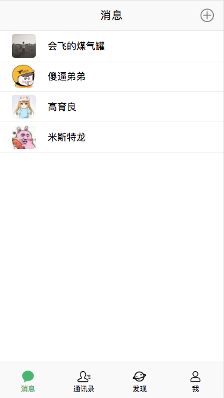
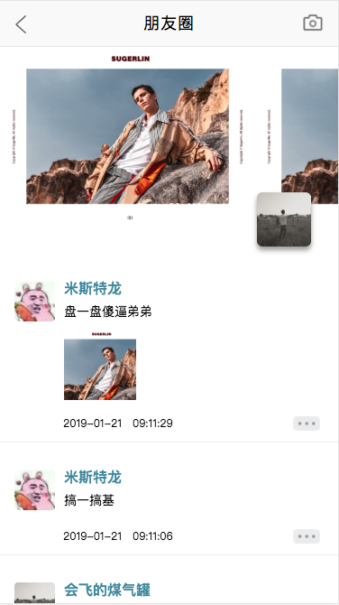
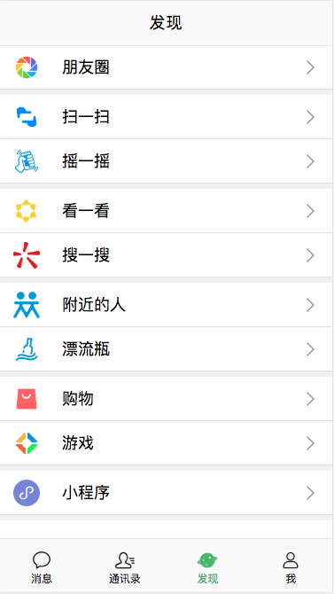
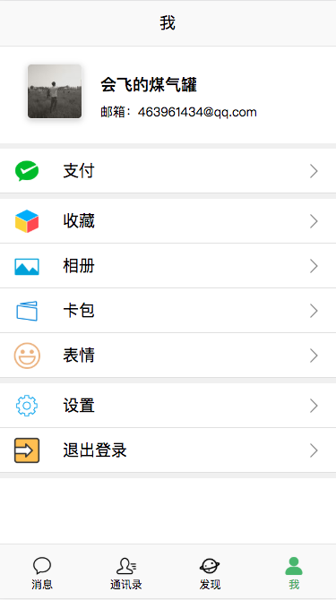
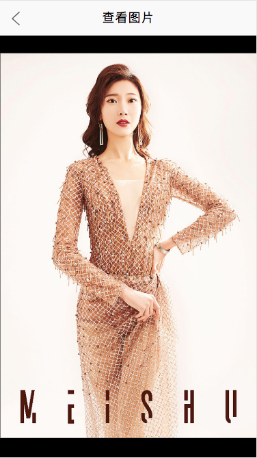
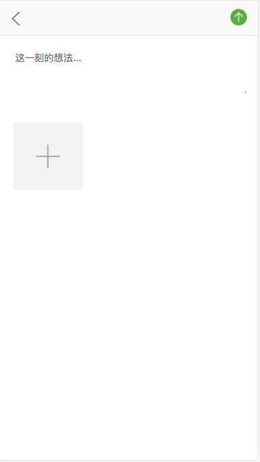
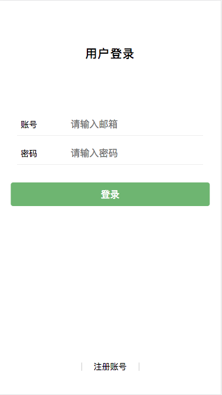
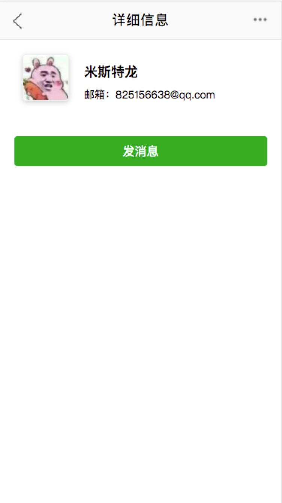
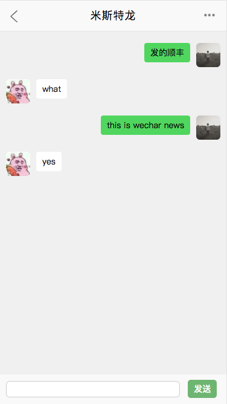

 # WeChar Message And Moments

> Technology stack

1. Client
    - Vue
    - VueRouter
    - Vuex
    - Websocket
    - Better-scroll
    - Axios

2. Server
    - passport
    - passport-jwt
    - jsonwebtoken
    - bcrypt
    - validator
    - ws
    - multer
    - mysql

>  View Demo












> open

```
$ cd wechar_news
$ npm install
$ cd client
$ npm install
$ cd ..
$ npm run dev
```

> Copyright

```
Copyright LINK CREATIVE STUDIO
Email  463961434@qq.com
Author display li
Address http://api.link97.com:8088
```